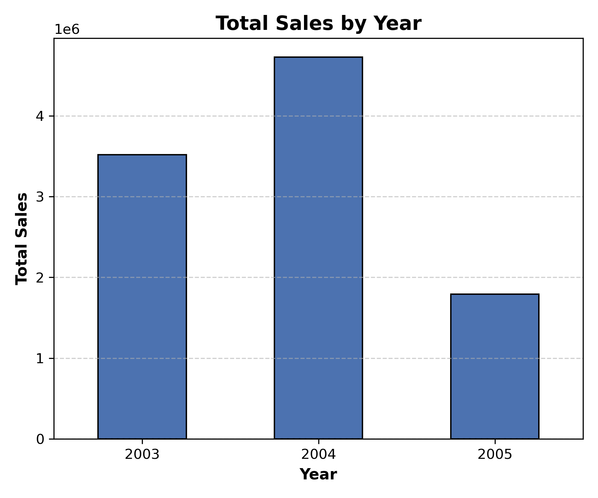
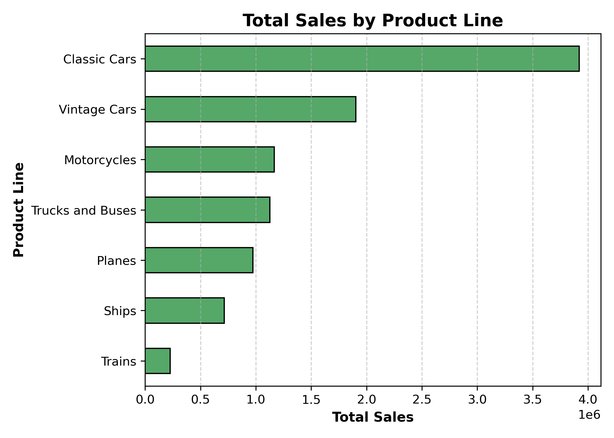
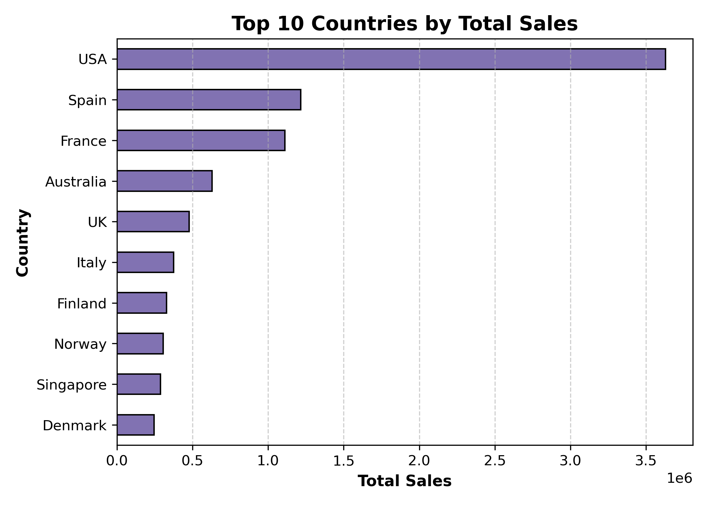

# Sales Performance Analysis Using Python

This project analyses a retail sales dataset to understand sales performance across time, product categories, and countries.

The focus is on answering clear business questions using clean and readable Python code.

## Overview

The dataset contains 2,823 sales records with information on order dates, product lines, quantities, prices, and total sales values.

The analysis explores:
- Overall sales performance
- Sales trends over time
- Sales distribution across product lines
- Sales performance by country

## Tools Used

- Python
- pandas
- matplotlib
- Jupyter Notebook

## Data Preparation

The following steps were carried out before analysis:
- Standardised column names
- Converted order dates to datetime format
- Created time-based features (year and month)
- Checked and handled missing values
- Focused on relevant variables for analysis

## Key Findings

- The dataset contains 2,823 rows and 27 columns.
- Total sales revenue is approximately 10.03 million.
- Sales peaked in 2004 and declined in 2005.
- The United States recorded the highest total sales.
- Other high-performing countries include Spain, France, Australia, and the United Kingdom.
- Sales are concentrated in a small number of key markets and product lines.

## Sample Visuals

### Total Sales by Year

### Total Sales by Product Line

### Top 10 Countries by Total Sales

## Project Structure

sales-performance-python/
│
├── data/
│ └── sales_data.csv
│
├── notebooks/
│ └── sales_analysis.ipynb
│
├── visuals/
│ ├── sales_by_year.png
│ ├── sales_by_product_line.png
│ └── sales_by_country.png
│
└── README.md

## Notes

This project is part of a data analysis portfolio focused on practical analysis using Python, SQL, Excel, and R.

